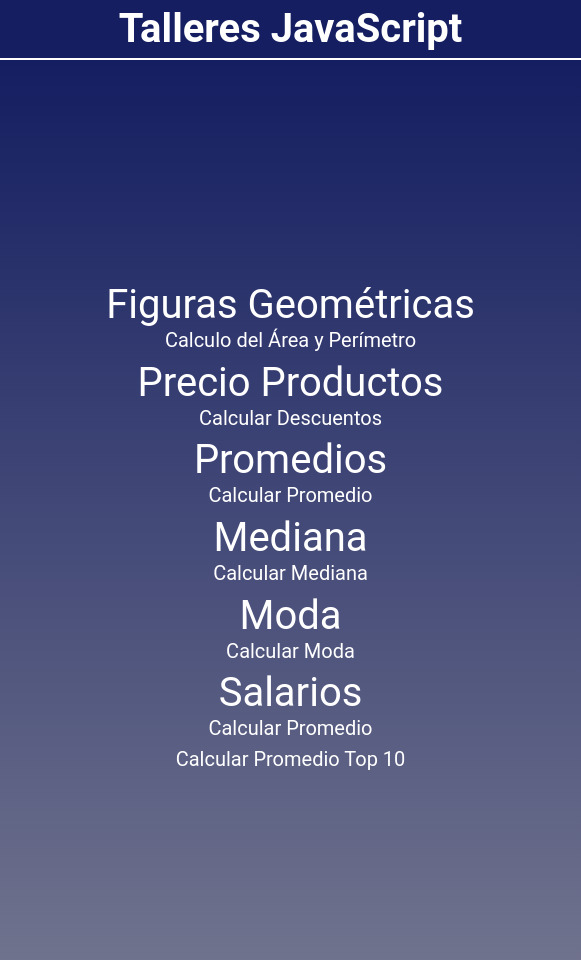

<h3>Hello Visitor!!</h3>

# Project: Practical Course JavaScript-Workshops 2021

## Website:

- [click here](https://roddevwork.github.io/JavaScript-Curso-Practico-Talleres/)

<kbd>
 
</kbd>
 

## Description:

- Exercises from a JavaScript workshop I did with Html, Css and JavaScript. Using the BEM methodology

- In the course they gave the bases of each workshop:

  -- Formula construction

  -- Basic html

  -- Js interaction with html

- Challenge for the student:

  --Do the logic functions. The layout and interaction with the user in each workshop

### Workshop #1: Geometric Figures:

- Calculate perimeter and area of square, triangle and circle

### Workshop #2: Percentages and Discounts:

- Calculate percentages, prices and discounts of products

### Workshop #3: Average:

- Calculate average of list of numbers

### Workshop #4: Medium:

- Calculate Median of list of numbers

### Workshop #5: Fashion:

- Calculate Mode of list of numbers

### Workshop #6: Salaries:

- Calculate the wage difference in your country

## Steps:

- First step: Define the formulas
- Second step: Implement the formulas in JavaScript
- Third step: Create functions
- Fourth step: Integrate JS with html
- Fifth step: Design and implement the interaction with the user

## Author:

- Rodrigo C

---

---

<h3>Hola Visitante!!</h3>

# Proyecto: Curso Practico JavaScrip-Talleres 2021

## Descripcion:

- Ejercicios de un taller de JavaScript que hice con Html, Css y JavaScript. Utilizando la metodología BEM

- En el curso dieron las bases de cada taller:

  -- Contrucion de fórmulas
  
  -- Html básico
  
  -- Interacion de js con html
  
  -- Reto: Hacer las funciones de lógica. La maquetación y la interación con el usuario en cada taller

### Taller #1: Figuras Geométricas:

- Calcular périmetro y área del cuadrado,triángulo y círculo

### Taller #2: Porsentajes y Descuentos:

- Calcular porsentajes, precios y descuentos de productos

### Taller #3: Promedio:

- Calcular promedio de lista de números

### Taller #4: Mediana:

- Calcular Mediana de lista de números

### Taller #5: Moda:

- Calcular Moda de lista de números

### Taller #6: Salarios:

- Calcular la diferencia salarial de tu país
- Calcular Promedio del top 10

## Pasos:

- Primer paso: Definir las fórmulas
- Segundo paso: Implementar las fórmulas en JavasScript
- Tercer paso: Crear funciones
- Cuarto paso: Integrar JS con html
- Quineto paso: Diseñar e implementarar la interaccion con el usuario

## Sito Web:

- [click Aquí](https://roddevwork.github.io/JavaScript-Curso-Practico-Talleres/)

## Autor:

- Rodrigo C 

---

